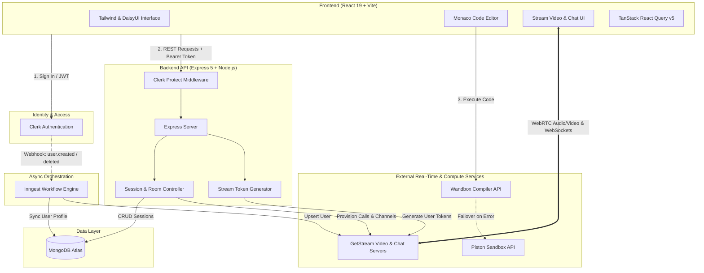

# ⚡ CodeCraft-Live

<div align="center">

  **A Real-Time Collaborative Coding & Technical Interview Platform**

  Connect face-to-face, collaborate in a synchronized code editor, execute multi-language code with automated test evaluation, and conduct seamless technical mock interviews.

  [](https://react.dev/)
  [](https://nodejs.org/)
  [](https://expressjs.com/)
  [](https://www.mongodb.com/)
  [](https://clerk.com/)
  [](https://getstream.io/)
  [](https://tailwindcss.com/)
  [](./LICENSE)

  [Features](#-key-features) • [Architecture](#-system-architecture) • [Tech Stack](#-tech-stack) • [Getting Started](#-getting-started) • [API Reference](#-api-endpoints) • [Resume Highlights](#-resume-bullet-points)

</div>

---

## 📌 Overview

**CodeCraft-Live** is a production-ready, full-stack collaborative platform designed to mirror modern technical interviews and remote pair-programming environments. It pairs a **Monaco Code Editor** with **real-time WebRTC audio/video conferencing** and **live channel messaging**, powered by an asynchronous **tri-tier code execution engine** and **event-driven user synchronization**.

---

## ✨ Key Features

### 🎥 High-Definition Video & Audio Conferencing
- **Peer-to-Peer & SFU Streaming**: Low-latency video calls powered by the `@stream-io/video-react-sdk`.
- **Integrated Call Controls**: Independent microphone mute, camera toggle, screen sharing, and participant connection states.
- **Floating & Resizable Call UI**: Dynamic camera grids designed to keep focus on code without sacrificing visual communication.

### 💬 Real-Time In-Session Chat
- **Instant Messaging**: Channel-based chat powered by GetStream Chat SDK (`stream-chat` & `stream-chat-react`).
- **Session-Scoped Channels**: Unique messaging rooms created automatically per interview session for code snippets and links.

### 💻 Monaco Code Editor & Resizable Workspace
- **Industry-Standard Editor**: VS Code-powered `@monaco-editor/react` with custom dark themes, syntax highlighting, and line formatting.
- **Multi-Language Support**: Instant switching between **JavaScript (Node.js)**, **Python 3**, and **Java**.
- **Adaptive Layout**: Split-panel workspace powered by `react-resizable-panels`, allowing developers to customize problem description, editor, and output console dimensions.

### ⚡ Resilient Tri-Tier Code Execution Engine
A fault-tolerant code runner architecture designed to ensure zero downtime during execution:
1. **Tier 1 (Primary)**: Compiles and executes via the remote **Wandbox API** (supports isolated sandboxing).
2. **Tier 2 (Fallback)**: Automatically falls back to the **Piston API** if Tier 1 experiences latency or rate limits.
3. **Tier 3 (Local Sandbox)**: For JavaScript, gracefully executes in a sandboxed client-side runtime with an overridden log interceptor if network execution endpoints are unreachable.

### 🧠 Curated Algorithm Suite & Automated Test Evaluation
- **Algorithm Problem Library**: Curated coding challenges across Easy, Medium, and Hard tiers with problem descriptions, constraints, examples, and starter templates.
- **Automated Output Normalizer**: Strips whitespace, standardizes array brackets, and parses tokens to accurately evaluate candidate solutions against expected outputs.
- **Interactive Feedback**: Real-time console logs, compiler error traces, and celebratory confetti animations (`canvas-confetti`) upon passing all test assertions.

### 🔄 Event-Driven User Sync (Inngest Serverless Workflows)
- **Background Event Orchestration**: Background synchronization handled via **Inngest**.
- **Webhook Automation**: Listens for Clerk authentication lifecycle events (`clerk/user.created`, `clerk/user.deleted`), synchronizing MongoDB records and Stream user directories idempotently with automated retries.

### 📊 Live Session Lifecycle & Dashboard
- **Role-Based Session Management**: Distinct permissions for Session Hosts vs Participants (join, end call, and clean up resources).
- **Session Discovery**: Real-time lobby displaying active interview rooms and completed session history.
- **Safe Teardown**: Automatically releases Stream video calls and messaging channels upon host termination.

---

## 🏗 System Architecture



---

## 🛠 Tech Stack

| Domain | Technologies & Libraries |
| :--- | :--- |
| **Frontend Framework** | React 19, Vite 7, React Router 7 |
| **State & Data Fetching** | TanStack React Query v5, Axios |
| **Styling & UI Components** | Tailwind CSS v4, DaisyUI 5, Lucide React, Canvas Confetti |
| **Code Editor** | `@monaco-editor/react`, `react-resizable-panels` |
| **Real-Time Communication** | GetStream Video React SDK (`@stream-io/video-react-sdk`), Stream Chat (`stream-chat-react`) |
| **Backend Framework** | Node.js, Express 5 (ES Modules) |
| **Database & ODM** | MongoDB, Mongoose 8 |
| **Authentication** | Clerk (`@clerk/react`, `@clerk/express`) |
| **Background Workflows**| Inngest (`inngest/express`) |
| **Code Execution** | Wandbox Compiler Engine, Piston API, Sandboxed Client Evaluation |

---

## 📂 Project Structure

```text
CodeCraft-Live/
├── backend/
│   ├── src/
│   │   ├── controllers/
│   │   │   ├── chatController.js         # Stream Chat token generation
│   │   │   ├── sessionController.js      # Session CRUD, lifecycle & Stream call management
│   │   │   └── sessionController.test.js # Controller test suites
│   │   ├── lib/
│   │   │   ├── db.js                     # MongoDB Mongoose connection
│   │   │   ├── env.js                    # Validated environment configuration
│   │   │   ├── inngest.js                # Inngest event functions for Clerk synchronization
│   │   │   └── stream.js                 # Stream Node SDK client initialization
│   │   ├── middleware/
│   │   │   └── protectRoute.js           # Clerk JWT verification & user attachment
│   │   ├── models/
│   │   │   ├── Session.js                # Session document schema (Host, Participant, CallId)
│   │   │   └── User.js                   # Synchronized user profile schema
│   │   ├── routes/
│   │   │   ├── chatRoutes.js             # Route endpoints for chat token minting
│   │   │   └── sessionRoute.js           # Route endpoints for session handling
│   │   └── server.js                     # Express app setup, CORS, static SPA fallback & startup
│   ├── .env.example
│   └── package.json
│
├── frontend/
│   ├── src/
│   │   ├── api/
│   │   │   └── sessions.js               # Axios client endpoints for sessions
│   │   ├── components/
│   │   │   ├── ActiveSessions.jsx        # Live active interview rooms list
│   │   │   ├── CodeEditorPanel.jsx       # Monaco editor instance & language selector
│   │   │   ├── CreateSessionModal.jsx    # Problem selection & room creator modal
│   │   │   ├── Navbar.jsx                # Responsive navbar with user profile & navigation
│   │   │   ├── OutputPanel.jsx           # Terminal output & execution error logs
│   │   │   ├── ProblemDescription.jsx    # Problem details, constraints & examples
│   │   │   ├── RecentSessions.jsx        # Session history & completed stats
│   │   │   ├── StatsCards.jsx            # User activity metrics cards
│   │   │   ├── VideoCallUI.jsx           # Stream WebRTC call grid & media controls
│   │   │   └── WelcomeSection.jsx        # Quick action hero banner
│   │   ├── data/
│   │   │   └── problems.js               # Algorithm problems dataset & test assertions
│   │   ├── hooks/
│   │   │   ├── useSessions.js            # TanStack Query hooks for session lifecycle
│   │   │   └── useStreamClient.js        # Stream Video & Chat client synchronization hook
│   │   ├── lib/
│   │   │   ├── axios.js                  # Axios instance with credentials
│   │   │   ├── piston.js                 # Multi-engine code execution service
│   │   │   ├── stream.js                 # Stream Video client factory
│   │   │   └── utils.js                  # Formatting & badge color utilities
│   │   ├── pages/
│   │   │   ├── DashboardPage.jsx         # User dashboard, session launcher & room history
│   │   │   ├── HomePage.jsx              # Landing page with feature showcases & CTA
│   │   │   ├── ProblemPage.jsx           # Solo coding environment with test runner
│   │   │   ├── ProblemsPage.jsx          # Problem set index & difficulty breakdown
│   │   │   └── SessionPage.jsx           # Collaborative room (Video + Chat + Monaco + Runner)
│   │   ├── App.jsx                       # Main router configuration & Clerk auth guards
│   │   └── main.jsx                      # Application entry point with React Query providers
│   ├── .env.example
│   ├── vite.config.js
│   └── package.json
│
├── .gitignore
├── package.json                          # Monorepo build and start orchestrator
└── README.md
```

---

## 🚦 Getting Started

### Prerequisites

Ensure you have the following installed on your machine:
- [Node.js](https://nodejs.org/) (v18.0.0 or higher)
- [npm](https://www.npmjs.com/) (v9.0.0 or higher)
- A [MongoDB Atlas](https://www.mongodb.com/atlas) instance or local MongoDB
- A free [Clerk](https://clerk.com/) account
- A free [GetStream](https://getstream.io/) account (Video & Chat)

---

### 1. Clone the Repository

```bash
git clone https://github.com/shivanshu360/CodeCraft-Live.git
cd CodeCraft-Live
```

---

### 2. Environment Variables Setup

#### Backend Configuration
Create a `.env` file in the `backend/` directory:

```bash
cp backend/.env.example backend/.env
```

Populate the keys inside `backend/.env`:

```env
PORT=5000
NODE_ENV=development
CLIENT_URL=http://localhost:5173

# MongoDB Connection
MONGO_URI=mongodb+srv://<username>:<password>@cluster.mongodb.net/codecraft?retryWrites=true&w=majority

# Clerk Authentication
CLERK_PUBLISHABLE_KEY=pk_test_...
CLERK_SECRET_KEY=sk_test_...

# Stream Video & Chat (GetStream.io Dashboard)
STREAM_API_KEY=your_stream_api_key
STREAM_API_SECRET=your_stream_api_secret

# Inngest Background Tasks
INNGEST_EVENT_KEY=your_inngest_event_key
INNGEST_SIGNING_KEY=your_inngest_signing_key
```

#### Frontend Configuration
Create a `.env` file in the `frontend/` directory:

```bash
cp frontend/.env.example frontend/.env
```

Populate the keys inside `frontend/.env`:

```env
VITE_CLERK_PUBLISHABLE_KEY=pk_test_...
VITE_API_URL=http://localhost:5000/api
VITE_STREAM_API_KEY=your_stream_api_key
```

---

### 3. Install Dependencies

You can install dependencies for both the backend and frontend simultaneously from the root directory:

```bash
npm run build
```

Or install them individually:

```bash
# Install backend dependencies
cd backend && npm install

# Install frontend dependencies
cd ../frontend && npm install
```

---

### 4. Running the Development Servers

Open two terminal instances:

**Terminal 1 (Backend Server):**
```bash
cd backend
npm run dev
```
> Server will start on `http://localhost:5000`

**Terminal 2 (Frontend Client):**
```bash
cd frontend
npm run dev
```
> Client will launch on `http://localhost:5173`

*(Optional) Terminal 3 (Inngest Dev Server for Webhook Testing):*
```bash
npx inngest-cli@latest dev -u http://localhost:5000/api/inngest
```

---

## 📡 API Endpoints

All protected endpoints require a valid Clerk session bearer token passed via headers or cookies.

### Authentication & Chat Tokens
| Method | Endpoint | Access | Description |
| :--- | :--- | :--- | :--- |
| `GET` | `/api/chat/token` | Protected | Generates a scoped GetStream user token for chat & video |

### Session Management
| Method | Endpoint | Access | Description |
| :--- | :--- | :--- | :--- |
| `POST` | `/api/sessions` | Protected | Creates a new coding session, initializes Stream call & chat |
| `GET` | `/api/sessions/active` | Protected | Retrieves up to 20 currently active interview sessions |
| `GET` | `/api/sessions/my-recent`| Protected | Retrieves completed sessions where the user participated |
| `GET` | `/api/sessions/:id` | Protected | Retrieves full session metadata by ID |
| `POST` | `/api/sessions/:id/join` | Protected | Adds the authenticated user as the participant to a session |
| `POST` | `/api/sessions/:id/end` | Protected (Host) | Marks session as completed and deletes Stream video/chat rooms |
| `DELETE`| `/api/sessions/:id` | Protected (Host) | Permanently deletes a session and associated Stream resources |

### System & Webhooks
| Method | Endpoint | Access | Description |
| :--- | :--- | :--- | :--- |
| `GET` | `/health` | Public | Backend health check verification endpoint |
| `ALL` | `/api/inngest` | Public/Signed | Inngest event webhook endpoint for background tasks |

---

## 🎯 Resume Bullet Points

Adding **CodeCraft-Live** to your resume? Here are bullet points highlighting the technical complexity, system design, and engineering decisions:

- **Engineered a full-stack real-time collaborative coding platform** supporting 1-on-1 WebRTC video/audio conferencing, real-time messaging, and interactive multi-language code execution.
- **Architected a resilient tri-tier code execution pipeline** combining Wandbox API, Piston API, and sandboxed browser execution fallbacks, achieving fault-tolerant execution across JavaScript, Python, and Java.
- **Integrated GetStream Video & Chat SDKs** to facilitate synchronized WebRTC media streams, screen sharing, and real-time chat with automated room provisioning and teardown lifecycles.
- **Implemented event-driven background synchronization using Inngest**, managing Clerk authentication webhooks with automated step-level retry mechanisms to synchronize MongoDB records and Stream user profiles.
- **Optimized client performance with React 19 and TanStack Query v5**, utilizing optimistic updates, cache invalidation, and split-pane Monaco Editor layouts for fluid developer workflows.

---

## 🤝 Contributing

Contributions, issues, and feature requests are welcome!

1. Fork the Project
2. Create your Feature Branch (`git checkout -b feature/AmazingFeature`)
3. Commit your Changes (`git commit -m 'Add some AmazingFeature'`)
4. Push to the Branch (`git push origin feature/AmazingFeature`)
5. Open a Pull Request

---

## 📄 License

This project is licensed under the ISC License. See the [LICENSE](./package.json) file for details.

<div align="center">
  <sub>Built with ❤️ by <a href="https://github.com/shivanshu360">Shivanshu</a></sub>
</div>
